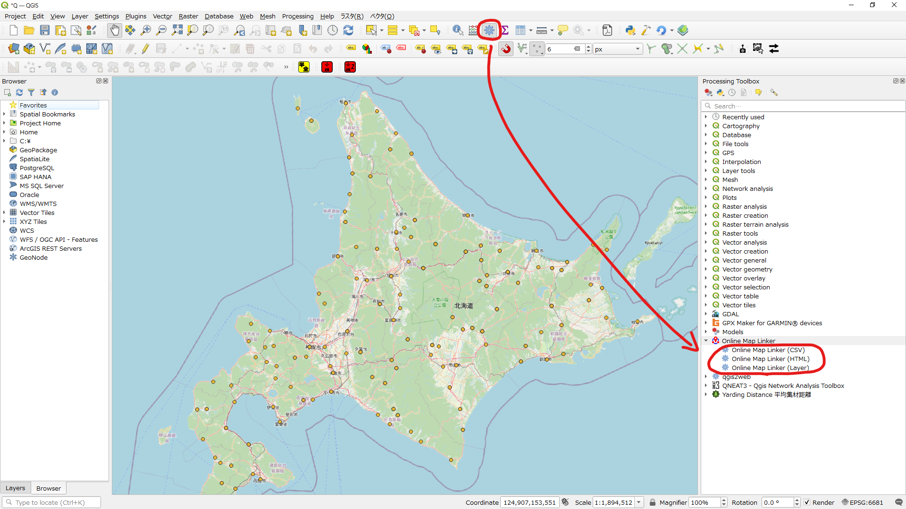

# Online Map Linker (OML)
This QGIS plugin outputs a links to an online map from a point layer.
# How to Make Links
## Starting method
 
Launch OML from the Processing Tools panel. 
## Setting method
 
Set parameters. 
You can link to these online maps. If you need other maps, please contact me. 
## Generated links
### New field in layer
 
### HTML format
 
### CSV format
 
